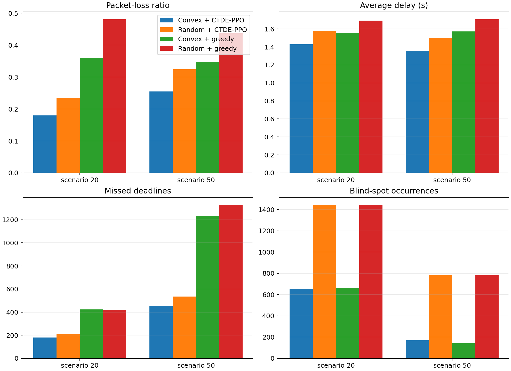
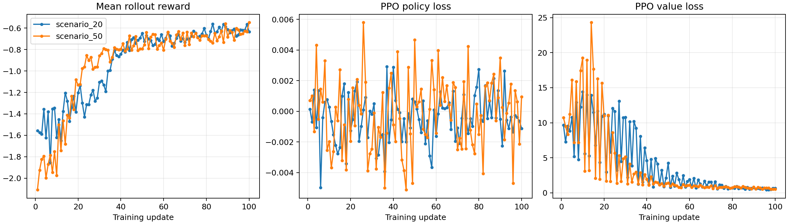
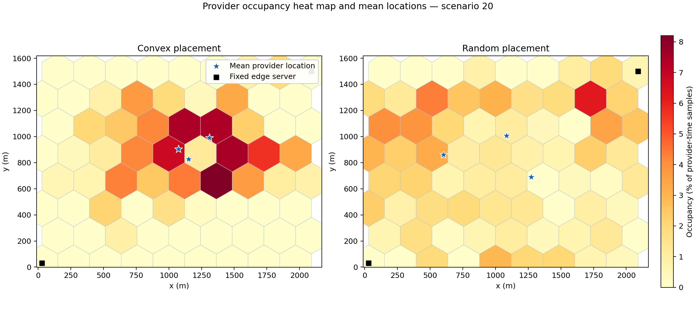
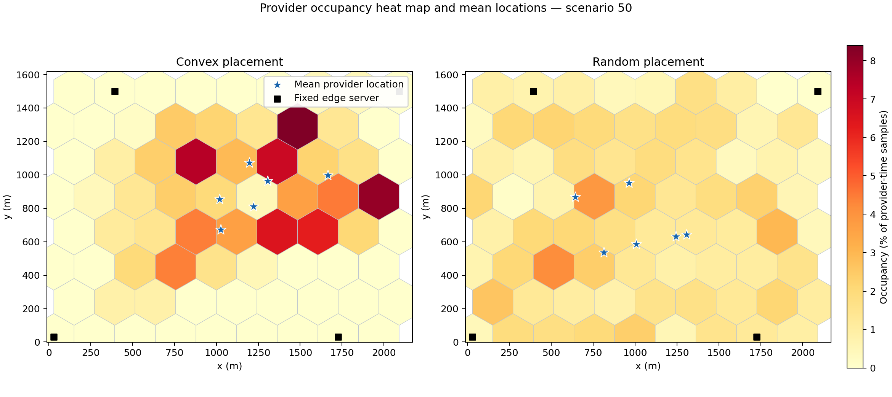

# SDN-Based Vehicular Edge Computing with Convex Provider Placement and CTDE-PPO Offloading
> This project was developed for the Real-Time-Systems course at SUT.

This repository implements a two-timescale vehicular edge computing simulator for provider-vehicle deployment and task offloading. Vehicle mobility is driven by a SUMO-style `simulation.out.xml` trace, the road area is converted into a hexagonal grid, provider vehicles move between hexagon centers using a convex optimization placement policy, and client vehicles learn task-offloading decisions using masked CTDE-PPO.

The project compares the proposed method against random provider placement and greedy offloading baselines under the two required scenarios:

| Scenario | Client vehicles | Provider vehicles | Fixed edge servers |
|---|---:|---:|---:|
| `scenario_20` | 20 | 3 | 2 |
| `scenario_50` | 50 | 6 | 4 |

The implementation also supports rendering a step-by-step video of vehicle movement, provider movement, task links, and server coverage.

---

## Output examples

### Network metrics



### PPO convergence



### Provider-location heatmaps

| Scenario 20 | Scenario 50 |
|---|---|
|  |  |

### Simulation video

https://github.com/Rezaei-Parham/SDN-Vehicle/blob/main/outputs/simulation_172_clients.mp4

---

## What the code does

The simulator models a vehicular edge network with three types of computing nodes:

- client vehicles, which generate real-time tasks;
- mobile provider vehicles, which act as moving edge servers;
- fixed edge servers, which provide higher-capacity infrastructure nodes.

At each simulation step:

1. The next vehicle positions and speeds are loaded from `simulation.out.xml`.
2. Vehicles generate computation tasks probabilistically.
3. Provider vehicles are periodically repositioned over a hexagonal grid using convex optimization.
4. Each client vehicle chooses where and how to offload its current task:
   - process locally,
   - send to a provider vehicle,
   - send to an edge server,
   - use a relay path when direct communication is weak or unavailable.
5. A Kalman filter updates link-loss estimates from noisy packet-loss measurements.
6. Delay, packet loss, missed deadlines, blind spots, and rewards are recorded.
7. PPO updates the offloading policy from collected rollouts.

---

## Main design choices

### Mobility from XML

The file `simulation.out.xml` is parsed by `vecsim/mobility.py`. The parser reads every timestep and extracts vehicle IDs, positions, speeds, and map bounds. The simulator uses the XML trace directly instead of generating synthetic mobility.

The map bounds are computed from the minimum and maximum vehicle positions across all timesteps. These bounds are then passed to `vecsim/hexgrid.py`, which creates hexagon centers covering the observed movement area.

### Hexagonal map

Provider vehicles are only allowed to target hexagon centers. This keeps provider placement discrete and interpretable while still allowing continuous movement between current provider positions and selected centers.

### Provider placement

Provider vehicles do not use RL. They use the convex placement policy in `vecsim/placement.py`.

The optimizer chooses provider-to-hex assignments that maximize expected demand coverage while penalizing unnecessary movement. After solving the relaxed optimization problem, the fractional solution is rounded into a valid one-hex-per-provider assignment.

### Client offloading with CTDE-PPO

Client vehicles use PPO for the task-offloading decision. The implementation follows CTDE:

- decentralized actor: each vehicle acts from its own observation and valid-action mask;
- centralized critic: training uses a wider global observation for more stable value estimation.

Invalid actions, such as selecting an out-of-range provider, are removed with action masking before sampling from the PPO policy.

---

## PPO observation features

The actor observation is intentionally compact. It contains base vehicle/task features plus per-action features.

Base features:

1. normalized queue length;
2. normalized task input size;
3. normalized task CPU-cycle demand;
4. normalized task deadline;
5. current weather condition;
6. local blind-spot indicator;
7. local queue pressure / service-pressure feature.

Per-action features:

1. estimated packet-loss probability for the action/path;
2. estimated delay for the action/path;
3. normalized capacity or feasibility feature for that destination/path.

This structure lets the actor score each candidate action using features that are directly related to the offloading objective: delay, loss, feasibility, and compute pressure.

---

## Core formulas

### Provider placement objective

For provider `p`, hexagon `h`, and client `i`:

```text
d_hi = || center_h - client_i ||
risk_hi = risk((center_h + client_i) / 2)
```

The placement module estimates provider-client success probability as:

```text
loss_logit_hi =
    -4.2
    + 5.7 * d_hi / provider_range
    + 1.15 * weather
    + 1.65 * risk_hi

success_hi = 1 - sigmoid(loss_logit_hi)
coverage_hi = success_hi, if d_hi <= provider_range
coverage_hi = 0,          otherwise
```

The convex assignment uses:

```text
maximize:
    sum_i demand_i * served_i
    - movement_penalty * sum_p,h movement_cost_p,h * assignment_p,h
```

with constraints:

```text
sum_h assignment_p,h = 1              for each provider p
occupancy_h = sum_p assignment_p,h
occupancy_h <= 1                      for each hex h
0 <= served_i <= 1                    for each client i
served_i <= sum_h coverage_h,i * occupancy_h
assignment_p,h = 0 for unreachable hexes
```

### Runtime packet loss

The network model in `vecsim/network.py` computes packet loss using distance, weather, spatial risk, and vehicle speed:

```text
d = || transmitter - receiver ||
midpoint = (transmitter + receiver) / 2
spatial = risk(midpoint)

logit =
    -4.2
    + 5.7 * d / communication_range
    + 1.15 * weather
    + 1.65 * spatial
    + 0.010 * speed

packet_loss = sigmoid(logit)
```

If the receiver is outside communication range, packet loss is set to `1.0`.

For multi-hop paths:

```text
path_loss = 1 - product_over_hops(1 - hop_loss)
```

### Transmission rate

The data rate uses a Shannon-style formula:

```text
normalized_distance = max(distance / communication_range, 0.02)

snr_db =
    25.0
    - 24.0 * log10(1.0 + 8.0 * normalized_distance)
    - 5.0 * weather

snr_linear = 10^(snr_db / 10)

rate_bps = max(1e5, bandwidth_hz * log2(1 + snr_linear))
```

Transmission delay is:

```text
delay = task_bits / rate_bps
```

For two-hop paths, the two hop delays are added.

---

## Repository structure

```text
vehicular_edge_project/
├── configs/
│   └── default.yaml              # Main experiment configuration
├── outputs/
│   ├── checkpoints/              # Trained PPO checkpoints
│   ├── figures/                  # Generated project plots
│   ├── training/                 # PPO training CSV logs
│   ├── simulation_172_clients.mp4
│   └── evaluation_summary.json
├── vecsim/
│   ├── cli.py                    # Command-line interface
│   ├── config.py                 # YAML config loading
│   ├── environment.py            # Main simulation environment
│   ├── evaluation.py             # Evaluation loop
│   ├── hexgrid.py                # Hexagonal grid generation
│   ├── kalman.py                 # Link-loss Kalman filter
│   ├── mobility.py               # XML trajectory parser
│   ├── network.py                # Packet loss and rate model
│   ├── placement.py              # Convex provider placement
│   ├── plotting.py               # Plot generation
│   ├── ppo.py                    # Masked CTDE-PPO implementation
│   └── video.py                  # Simulation video renderer
└── pyproject.toml
```

---

## Installation

Use Python 3.9 or newer.

```bash
cd vehicular_edge_project
python3 -m venv .venv
source .venv/bin/activate
python -m pip install --upgrade pip
python -m pip install -e ".[dev]"
```

If you do not need the test dependencies:

```bash
python -m pip install -e .
```

---

## Input trace

This project expects a SUMO FCD-style XML file named `simulation.out.xml`.

Recommended layout:

```text
vehicular_edge_project/
└── data/
    └── simulation.out.xml
```

The current repository does not need to commit the XML trace if it is large. You can keep it outside the repository and pass its absolute path to the CLI.

Example:

```bash
vecsim analyze --xml data/simulation.out.xml
```

The analyze command reports:

- number of timesteps;
- start/end simulation time;
- min/max map bounds;
- minimum and maximum active vehicles per timestep;
- number of unique vehicle IDs;
- whether the trace can support the configured scenarios.

---

## Running the full project

Train PPO, evaluate all required scenarios, compare against baselines, and generate the final plots:

```bash
vecsim run-all \
  --xml data/simulation.out.xml \
  --output outputs \
  --updates 100 \
  --episodes 5 \
  --device cpu
```

Generated files:

```text
outputs/evaluation_summary.json
outputs/checkpoints/scenario_20_ppo.pt
outputs/checkpoints/scenario_50_ppo.pt
outputs/training/scenario_20.csv
outputs/training/scenario_50.csv
outputs/figures/network_metrics.png
outputs/figures/ppo_convergence.png
outputs/figures/scenario_20_provider_locations.png
outputs/figures/scenario_50_provider_locations.png
```

Use `--device cuda` on an NVIDIA GPU or `--device mps` on Apple Silicon if PyTorch supports it in your environment.

---

## Running one scenario

Train only `scenario_20`:

```bash
vecsim train \
  --xml data/simulation.out.xml \
  --scenario scenario_20 \
  --output outputs/scenario_20_run \
  --updates 100 \
  --device cpu
```

Evaluate a saved checkpoint:

```bash
vecsim evaluate \
  --xml data/simulation.out.xml \
  --scenario scenario_20 \
  --checkpoint outputs/checkpoints/scenario_20_ppo.pt \
  --output outputs/eval_scenario_20 \
  --episodes 5 \
  --device cpu
```

---

## Rendering a simulation video

Render a video using all available XML vehicles, or specify a smaller number with `--clients`.

```bash
vecsim video \
  --xml data/simulation.out.xml \
  --scenario scenario_50 \
  --checkpoint outputs/checkpoints/scenario_50_ppo.pt \
  --output outputs/simulation_172_clients.mp4 \
  --clients 172 \
  --frames 160 \
  --fps 10 \
  --placement convex \
  --device cpu
```

If `--checkpoint` is omitted, the video uses the greedy offloader instead of PPO:

```bash
vecsim video \
  --xml data/simulation.out.xml \
  --scenario scenario_50 \
  --output outputs/simulation_greedy.mp4 \
  --clients 172 \
  --frames 160
```

The renderer also writes a JSON metadata file next to the MP4.

---


## Configuration

Most experiment parameters are in `configs/default.yaml`.

Important parameters:

| Parameter | Meaning |
|---|---|
| `hex_radius_m` | Hexagon radius used to discretize the map |
| `placement_interval_s` | How often provider targets are recomputed |
| `provider_speed_mps` | Maximum provider movement speed |
| `provider_range_m` | Provider communication range |
| `edge_range_m` | Fixed-edge communication range |
| `relay_range_m` | Vehicle-to-vehicle relay range |
| `bandwidth_hz` | Wireless channel bandwidth |
| `local_cpu_hz` | Client-vehicle CPU capacity |
| `provider_cpu_hz` | Provider-vehicle CPU capacity |
| `edge_cpu_hz` | Fixed-edge CPU capacity |
| `task_arrival_probability` | Probability that a vehicle generates a task per step |
| `task_deadline_min_s` / `task_deadline_max_s` | Deadline range for generated tasks |
| `deadline_penalty` | Reward penalty for missed deadlines |
| `loss_penalty` | Reward penalty for packet loss |
| `blind_spot_threshold` | Loss threshold used to count blind spots |

---

## Generated plots required by the assignment

The project generates all requested plots:

| Required plot | Output file |
|---|---|
| Average packet-loss ratio | `outputs/figures/network_metrics.png` |
| Average system delay | `outputs/figures/network_metrics.png` |
| Number of missed deadlines | `outputs/figures/network_metrics.png` |
| Number of blind-spot occurrences | `outputs/figures/network_metrics.png` |
| Average/location heatmap of provider vehicles | `outputs/figures/scenario_20_provider_locations.png`, `outputs/figures/scenario_50_provider_locations.png` |
| PPO convergence | `outputs/figures/ppo_convergence.png` |


